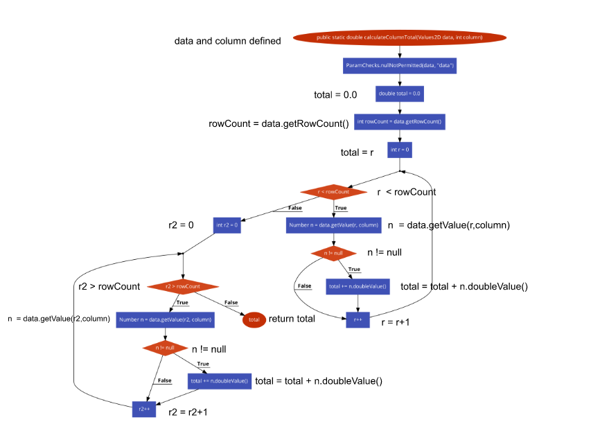
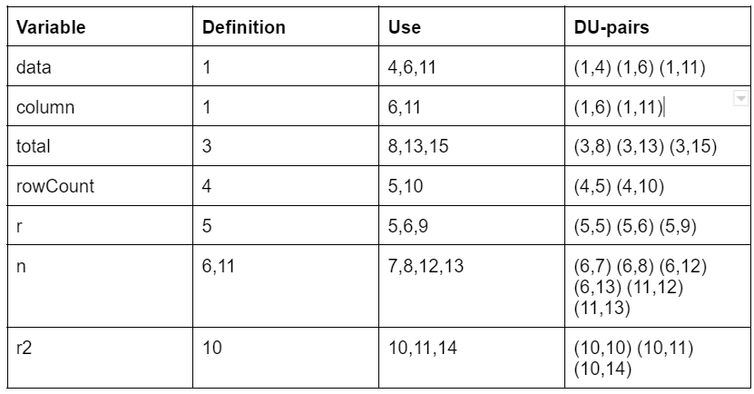
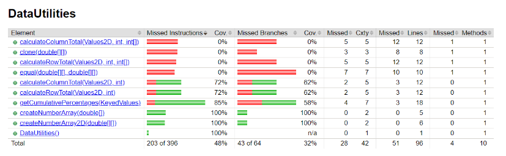
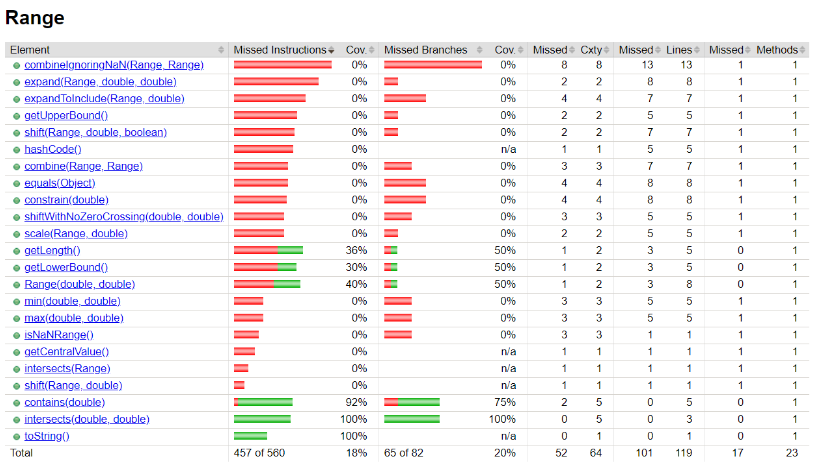

**SENG 438 - Software Testing, Reliability, and Quality**

**Lab. Report #3 – Code Coverage, Adequacy Criteria and Test Case Correlation**

| Group \#: 26    |     |
| -------------- | --- |
| Student Names: |     |
|  Muhammad Hasan              |     |
|  Eric Wong              |     |
|  Myles Pribeg              |     |
|  Sasha Kobrusev              |     |

(Note that some labs require individual reports while others require one report
for each group. Please see each lab document for details.)

# 1 Introduction

The purpose of this assignment was to perform more unit testing using Junit in eclipse. In the last assignment we were tasked with created black box unit tests using Junit, and in this assignment we will create more unit tests through white box testing. We will be developing tests using the white box technique and attempting to increase the coverage of 2 classes within JFreeChart, these are Datautilities and Range. We will be using Eclipse's built in coverage tool to check the adequecy of the written unit tests. There are 3 types of coverage that we will be focusing on in this assignment, these are Statement, Branch and Method Coverage. 

# 2 Manual data-flow coverage calculations for X and Y methods  

## Manual data flow calculations for DataUtilities.calculateColumnTotal  

```
1. public static double calculateColumnTotal(Values2D data, int column) {  
2.  ParamChecks.nullNotPermitted(data, "data");  
3. double total = 0.0;  
4. int rowCount = data.getRowCount();  
5.  for (int r = 0; r < rowCount; r++) {    
6.     Number n = data.getValue(r, column);      
7.       if (n != null) {    
8.          total += n.doubleValue();  
            }  
9. }  
10.  for (int r2 = 0; r2 > rowCount; r2++) {  
11.      Number n = data.getValue(r2, column);  
12.     if (n != null) {  
13.         total += n.doubleValue();  
         }  
14.   }  
15.    return total;  
    
Line 1: Def(data), Def(column)  
Line 3: Def(total)  
Line 4: Def(rowCount), Use(data)  
Line 5: Def(r), Use(rowCount), Use(r)  
Line 6: Def(n), Use(r), Use(data), Use(column)  
Line 7: Use(n)  
Line 8: Use(total), Use(n)  
Line 9: Use(r)  
Line 10: Def(r2), Use(rowCount), Use(r2)  
Line 11(unreachable): Def(n), Use(data), Use(r2), Use(column)  
Line 12(unreachable): Use(n)  
Line 13(unreachable): Use(total), Use(n)  
Line 14(unreachable): Use(r2)  
Line 15: Use(total)  
```
**data flow chart**   
  

**du table**  
  

**Test case coverage**

Test case: calculateValidRows()
1 -> 2 -> 3 -> 4 -> section repeated 4 times (5 -> 6 -> 7 -> 8 -> 9 ) ->10 ->15 

13/22 (59.1%) DU pairs covered

Covered: data(1,4), data(1,6), column(1,6), total(3,8), total(3,15), rowCount(4,5), rowCount(4,10), r(5,5), r(5,6), r(5,9), n(6,7), n(6,8), r2(10,10)

Test case: calculateNoRow()

1-> 2 -> 3 -> 4 -> 5 -> 10 -> 15

5/22 (22.7%) DU pairs covered


Covered: data(1,4), total(3,15), rowCount(4,5), r(5,5), r2(10,10)

Test case: calculateInvalidRow()
1 -> 2 -> 3 -> 4 -> section repeated 4 times (5 -> 6 -> 7 -> 9 ) ->10 ->15 

11/22 (50%) DU pairs covered

Covered: data(1,4), data(1,6), column(1,6),  total(3,15), rowCount(4,5), rowCount(4,10), r(5,5), r(5,6), r(5,9), n(6,7), r2(10,10)

Test case: nullObjectTest()
1 -> 2 

0/22 (0%) DU pairs covered

Test case: negativeColumnTest()
1-> 2 -> 3 -> 4 -> 5 -> 10 -> 15

5/22 (22.7%) DU pairs covered


Covered: data(1,4), total(3,15), rowCount(4,5), r(5,5), r2(10,10)

## Manual data flow calculations for Range.intersects

Def-use sets per statement:
2nd method

 1.    public boolean intersects(double b0, double b1) {
 2.        if (b0 <= this.lower) {
 3.            return (b1 > this.lower);
 4.       }
 5.        else {
 6.            return (b0 < this.upper && b1 >= b0);
 7.        }
 8.    }

(before function call)
def(this.lower), def(this. upper)
(after function call - numbers correlate to code above)
1. def(b0), def(b1)
2. use(b0), use(this.lower)
3. use(b1), use(this.lower)
4. 
5.
6. use(b1), use(b0), use(this.upper)
7.
8.


| Variable   | Def-line    | Use-line | DU pairs |
| -------------- | --- | ----| ---- |
| b0 | 1 | 3, 7 | (1, 3), (1, 7) |
| b1 | 1 | 4, 7 | (1, 4), (1, 7) |
| this.lower | 0 | 3,4 | (0,3), (0,4) |
| this.upper | 0 | 7 | (0,7) |


Test case: intersectInvalidParamaters  
1 -> 2 -> 3 -> 6 -> 7  
Covers: b0(1,3), this.lower(0,3), b0(1,7), this.upper(0.7), b1(1,7)  
5/7 (71.4%) DU pairs covered  

Test case: intersectUpperBoundNotOverLapping  
1 -> 2 -> 3 -> 6 -> 7  
Covers: b0(1,3), this.lower(0,3), b0(1,7), this.upper(0.7), b1(1,7)  
5/7 (71.4%) DU pairs covered  

Test case: intersectLowerBoundNotOverLapping  
1 -> 2 -> 3 -> 6 -> 7  
Covers: b0(1,3), this.lower(0,3), b0(1,7), this.upper(0.7), b1(1,7)  
5/7 (71.4%) DU pairs covered  

Test case: intersectUpperBoundOverLapping  
1 -> 2 -> 3 -> 6 -> 7  
Covers: b0(1,3), this.lower(0,3), b0(1,7), this.upper(0.7), b1(1,7)  
5/7 (71.4%) DU pairs covered  

Test case: intersectLowerBoundOverLapping  
1 -> 2 -> 3 -> 4  
Covers: b0(1,3), this.lower(0,3), b1(1,4), this.lower(0,4)  
4/7 (57.1%) DU pairs covered  

Test case: intersectBothBoundsOverLapping  
1 -> 2 -> 3 -> 4  
Covers: b0(1,3), this.lower(0,3), b1(1,4), this.lower(0,4)  
4/7 (57.1%) DU pairs covered  

Test case: intersectNoRangeOverLapping  
1 -> 2 -> 3 -> 6 -> 7  
Covers: b0(1,3), this.lower(0,3), b0(1,7), this.upper(0.7), b1(1,7)  
5/7 (71.4%) DU pairs covered  

Test case: intersectUpperBoundNoOverlapping  
1 -> 2 -> 3 -> 6 -> 7  
Covers: b0(1,3), this.lower(0,3), b0(1,7), this.upper(0.7), b1(1,7)  
5/7 (71.4%) DU pairs covered  

Test case: intersectLowerBoundNoOverlapping  
1 -> 2 -> 3 -> 4  
Covers: b0(1,3), this.lower(0,3), b1(1,4), this.lower(0,4)  
4/7 (57.1%) DU pairs covered  


# 3 A detailed description of the testing strategy for the new unit test

Our testing strategy for this assignment would make use of the coverage tool provided within eclipse (eclemma) and the white box testing technique to develop our new unit tests. Firstly, we decided to create test methods for every method within Range and Datautilities. After this first round of testing production we checked the coverage of the unit tests and created more tests based on missing branches and statements. Each iteration was made and checked for increased coverage until an adequate amount of coverage was achieved. In our case there were specific branches that we were unable to reach (infeasible path).

# 4 A high level description of five selected test cases you have designed using coverage information, and how they have increased code coverage

**1. getCumulativePercentages(KeyedValues data) test case nullFilledKeyedValues() in getCumulativePercentagesTest.java**

nullFilledKeyedValues()
This test case increased branch coverage in getCumulativePercentages by reaching a branch in the code that was previously not covered. 
The test case created a KeyedValues object with valid keys but null values associated with each of the keys. This covered the branch in getCumulativePercentages where the value was checked to be null or not. 

**2. equal(double[][] a, double[][] b) test case SecondNullArray() in equalTest.java**

This test case increased method coverage, line coverage and branch coverage for the equal function in DataUtilities.
The test case used a non null array as the first argument and a null array as the second argument. This covers the function equal 
that was not previously covered, the branch in equal where b == null and the statement returning false.

 **3. calculateRowTotal(Values2D data, int row,int[] validCols) test case calculateNegColCount() in caculateRowTotalTest2.java**

calculateNegColCount()
This test case increased method coverage, line coverage and branch coverage for the calculateRowTotal(Values2D data, int row,int[] validCols)  function in DataUtilities. The test case created a mock for values2D with a column count of negative one and passed it as an argument for data in calculateRowTotal(Values2D data, int row,int[] validCols). This covers the function calculateRowTotal(Values2D data, int row,int[] validCols) that was not previously covered, the branch in the function checking if the column count was less than zero,
and the statement modifying the total to be equal to 0.0.

**4. clone(double[][] source) test case filledArray() in cloneTest.java**

This test case increased method coverage, statement coverage, and branch coverage for the clone(double[][] source) function 
in DataUtilities. The test case created a 2d array filled with valid not null double values and used it as an argument for clone.
This covers the clone method that previously was not covered, the branch in the function that entered the loop with the source length 
being greater than 0, and the statements within the while loop where the values were not null.

**5. calculateColumnTotal(Values2D data, int column,int[] validRows) test case calculateNoRows() in calculateColumnTotalTest2.java**

This test case increased method coverage, and branch coverage for the calculateColumnTotal(Values2D data, int column,int[] validRows) function in DataUtilities. The test case used a mock to create an empty Values2D table with no rows or columns and 
passed it as an argument in calculateColumnTotal(Values2D data, int column,int[] validRows). This covers the calculateColumnTotal(Values2D data, int column,int[] validRows) method not previously covered, the branch in the function of the for loop where the length is equals to zero and does not enterr into the for loop.

# 5 A detailed report of the coverage achieved of each class and method (a screen shot from the code cover results in green and red color would suffice)

**Old assignment 2 Coverage**     




**New Improved Coverage**    


Some branches of the code were inaccessable (infeasible path) so the statement coverage was unable to achieve atleast 90% for DataUtilities(89.9%) and Range(85%)
For example, getCumulativePercentages has a branch that requires an itemcount less than 0 which would cause an exception to be thrown and caught internally causing an
error in the test with no additional coverage

# 6 Pros and Cons of coverage tools used and Metrics you report

Some Pros and Cons of EclEmma, which is the coverage tool we are that is it easy to use and was built into Eclipse already meaning that we did not have to install anything making the barrier to entry much lower than with the other suggested tools. It also included many important coverage metrics such as method coverage, branch coverage, and statement coverage giving us a comprehensive view of our test coverage. A downside of EclEmma is that is does not include support for Condition Coverage which forced us to replace that metric with simple method coverage, which doesn't give us as much information on the quality of our test coverage.

The pros and cons of each of the metrics we reported will now be discussed. Method coverage is the weakest of the three metrics we reported and does not give a very good idea of how comprehesive our test suite actually is, providing on the bare minimum of whether or not all methods are even tested. However, it does provide a good quick-glance overview to ensure that all functions of the program have at least some level of testing. Statement coverage provides a good measure of the amount of code that has been executed during testing and can help identify untested code segments that may contain errors. It is much more comprehensive than method coverage, however, it doesn't check whether all paths through the code are tested, only that all lines are reached. Branch coverage is most comprehensive of the 3 and can identify untested decision points in the code and can also help identify potential errors in the decision-making process of the code. The disadvantages of it are that it can be more difficult to measure and interpret than statement coverage and it can provide a false sense of security as it doesn't measure the quality of the tests.

# 7 A comparison on the advantages and disadvantages of requirements-based test generation and coverage-based test generation.


Requirements-based test generation:
Requirements-based test generation is a testing approach that involves creating test cases based directly off of the software requirements.  

Advantages:
- It ensures that the software is tested against the desired functionality, as defined by the requirements.
- It can help identify gaps or ambiguities in the requirements, which can be addressed before the software is developed.
- It can help ensure that the software meets the customer's expectations.  

Disadvantages:
- It may not cover all possible scenarios or edge cases that are not explicitly stated in the requirements.
- It may be difficult to ensure that all the requirements are adequately tested, as some requirements may be complex or difficult to verify.
- It may be time-consuming to derive test cases from the requirements, especially for large or complex software systems.  

Coverage-based test generation:
Coverage-based test generation is a testing approach that is based around measuring the coverage of the code and generating test cases to ensure that all code paths are executed. 

Advantages:
- It can in some cases be more comprehensive
- It can help identify untested areas of the code
- It can be automated, making it easier and faster to generate test cases.

Disadvantages:
- It may not cover all possible scenarios or edge cases that are not related to code paths, such as performance or security issues.
- It may not ensure that the software meets the desired functionality, as defined by the requirements.
- It may generate redundant or unnecessary test cases, increasing the time and effort required for testing.

# 8 A discussion on how the team work/effort was divided and managed

The original Junit tests created using the black box technique were updated to increase coverage using the white box technique using the plan above. The remaining extra functions were then split up evenly among group members and each member worked on getting the highest possible coverage for their assigned methods. We then came together and reviewed each others code and improved on them wherever possible, the Manual coverage calculations were also assigned to specific group members and then we came together to complete the lab report document as a group.

# 9 Any difficulties encountered, challenges overcome, and lessons learned from performing the lab

The main difficulties was creating test cases for private methods. Since we decided to do method coverage we need to cover every method in the class and that includes the private classes. Furthermore, the coverage program we agreed on eclemma did not support condition coverage so we decided to do method coverage instead. There was also the additional problem of some branches of the method being impossible to test. For instances getlowerbound tested if the lower bound was higher then the upper bound and threw an exception. However this condition was impossible since in the constructor it checked the same conditions and there were no setters that could change the bound. The lessons we learned this lab was how to do white box testing and how to write proper tests that are able to cover method coverage completely and the importance of it

# 10 Comments/feedback on the lab itself

The lab introduced white box testing and applications of test coverage. It was very useful to see how to write proper test cases that were able to cover different coverage metrics of the methods and to see the benefits and drawbacks of each. The only improvement for this lab i would make is to introduce more complex methods to test so that testing branch conditions is more intriguing and so we can see the benefits of branch coverage
