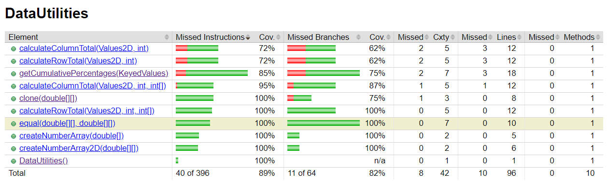
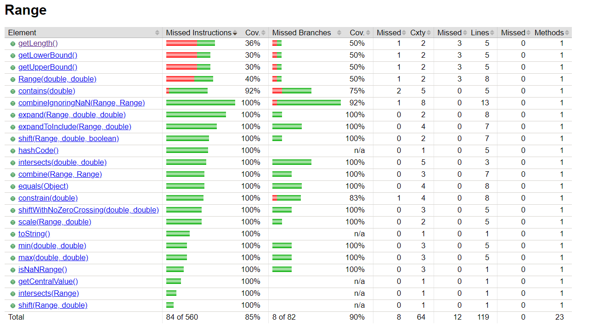

**SENG 438 - Software Testing, Reliability, and Quality**

**Lab. Report #3 – Code Coverage, Adequacy Criteria and Test Case Correlation**

| Group \#: 26    |     |
| -------------- | --- |
| Student Names: |     |
|  Muhammad Hasan              |     |
|  Eric Wong              |     |
|  Myles Pribeg              |     |
|  Sasha Kobrusev              |     |

(Note that some labs require individual reports while others require one report
for each group. Please see each lab document for details.)

# 1 Introduction

The purpose of this assignment was to perform more unit testing using Junit in eclipse. In the last assignment we were tasked with created black box unit tests using Junit, and in this assignment we will create more unit tests through white box testing. We will be developing tests using the white box technique and attempting to increase the coverage of 2 classes within JFreeChart, these are Datautilities and Range. We will be using Eclipse's built in coverage tool to check the adequecy of the written unit tests. There are 3 types of coverage that we will be focusing on in this assignment, these are Statement, Branch and Method Coverage. 

# 2 Manual data-flow coverage calculations for X and Y methods

Text…

# 3 A detailed description of the testing strategy for the new unit test

Our testing strategy for this assignment would make use of the coverage tool provided within eclipse (eclemma) and the white box testing technique to develop our new unit tests. Firstly, we decided to create test methods for every method within Range and Datautilities. After this first round of testing production we checked the coverage of the unit tests and created more tests based on missing branches and statements. Each iteration was made and checked for increased coverage until an adequate amount of coverage was achieved. In our case there were specific branches that we were unable to reach (infeasible path).

# 4 A high level description of five selected test cases you have designed using coverage information, and how they have increased code coverage

**1. getCumulativePercentages(KeyedValues data) test case nullFilledKeyedValues()**

nullFilledKeyedValues()
This test case increased branch coverage in getCumulativePercentages by reaching a branch in the code that was previously not covered. 
The test case created a KeyedValues object with valid keys but null values associated with each of the keys. This covered the branch in getCumulativePercentages where the value was checked to be null or not. 

**2. equal(double[][] a, double[][] b) test case SecondNullArray()**

This test case increased method coverage, line coverage and branch coverage for the equal function in DataUtilities.
The test case used a non null array as the first argument and a null array as the second argument. This covers the function equal 
that was not previously covered, the branch in equal where b == null and the statement returning false.

 **3. calculateRowTotal(Values2D data, int row,int[] validCols) test case calculateNegColCount()**

calculateNegColCount()
This test case increased method coverage, line coverage and branch coverage for the calculateRowTotal(Values2D data, int row,int[] validCols)  function in DataUtilities. The test case created a mock for values2D with a column count of negative one and passed it as an argument for data in calculateRowTotal(Values2D data, int row,int[] validCols). This covers the function calculateRowTotal(Values2D data, int row,int[] validCols) that was not previously covered, the branch in the function checking if the column count was less than zero,
and the statement modifying the total to be equal to 0.0.

# 5 A detailed report of the coverage achieved of each class and method (a screen shot from the code cover results in green and red color would suffice)

Some branches of the code were inaccessable (infeasible path) so the statement coverage was unable to achieve atleast 90% for DataUtilities(89.9%) and Range(85%)
# 6 Pros and Cons of coverage tools used and Metrics you report

Text…

# 7 A comparison on the advantages and disadvantages of requirements-based test generation and coverage-based test generation.

Text…

# 8 A discussion on how the team work/effort was divided and managed

The original Junit tests created using the black box technique were updated to increase coverage using the white box technique using the plan above. The remaining extra functions were then split up evenly among group members and each member worked on getting the highest possible coverage for their assigned methods. We then came together and reviewed each others code and improved on them wherever possible, the Manual coverage calculations were also assigned to specific group members and then we came together to complete the lab report document as a group.

# 9 Any difficulties encountered, challenges overcome, and lessons learned from performing the lab

Text…

# 10 Comments/feedback on the lab itself

Text…
